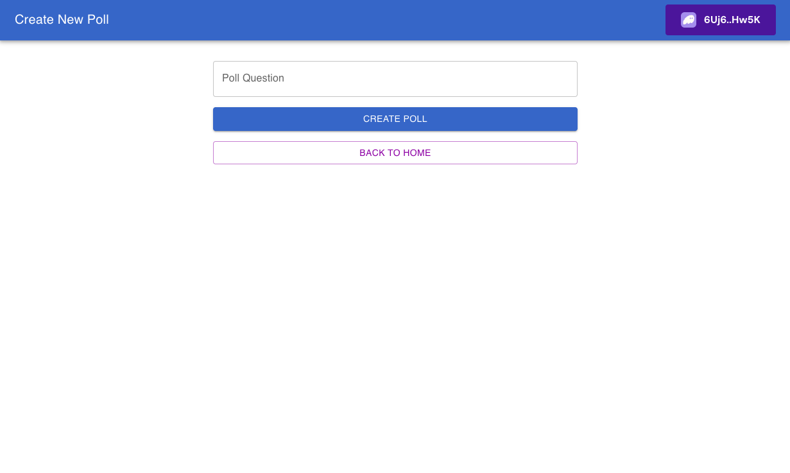
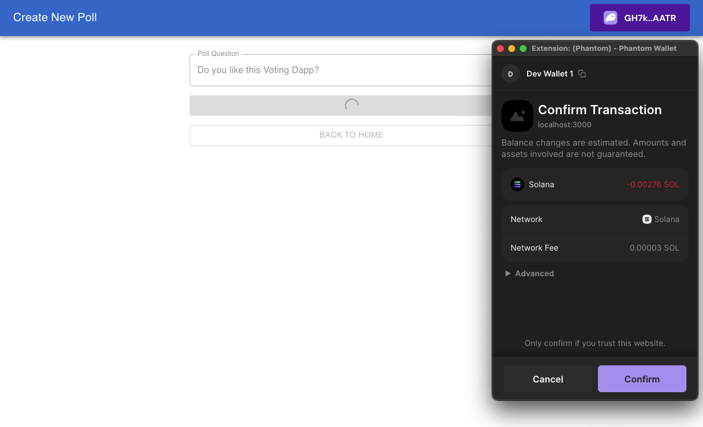
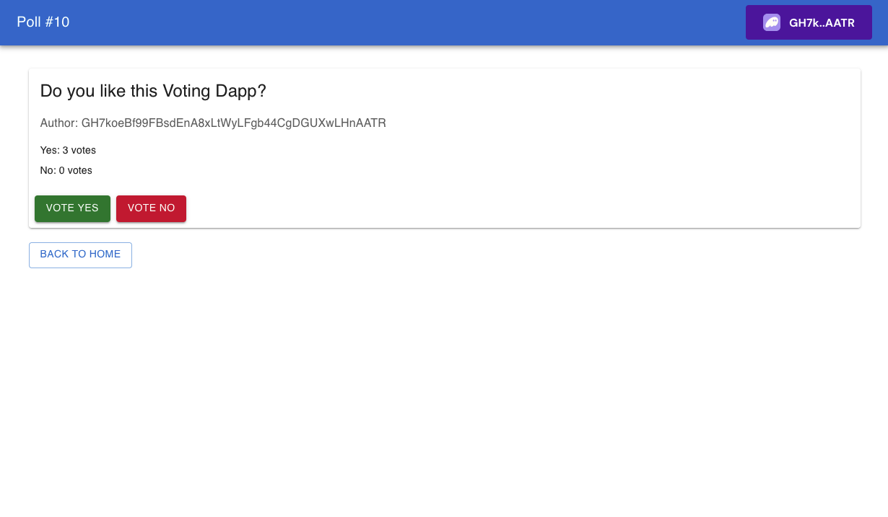
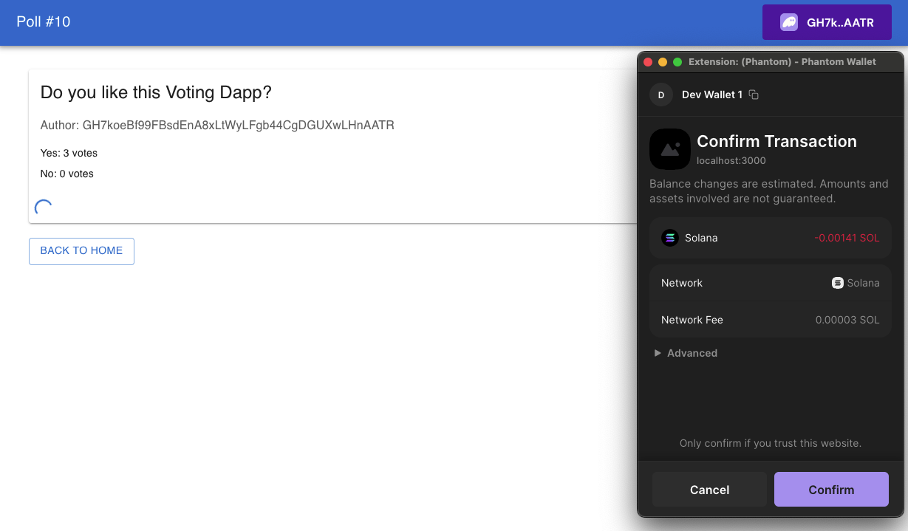
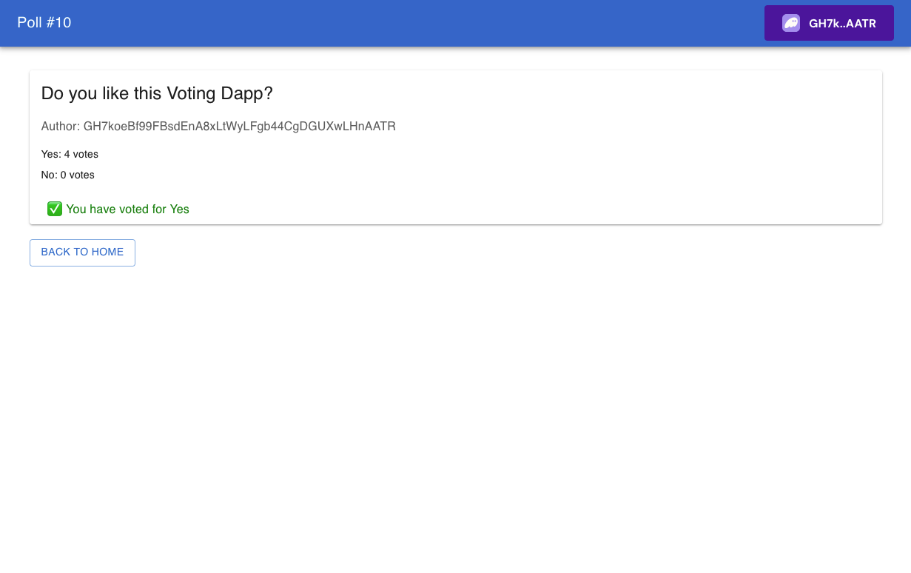

# Solana Voting App







This project is a decentralized voting application built on Solana using the Anchor framework. It allows users to create polls, cast votes, and securely store results on-chain. It serves as a comprehensive example for learning about Solana's account management, Program Derived Addresses (PDAs), and complex interactions within Solana programs.

## Features

- **Global State Management**: Centralized state with a global poll counter for unique identification.
- **Poll Creation**: Users can create polls with a custom question.
- **Secure Voting**: Each voter can cast their vote only once per poll, enforced by PDAs.
- **On-Chain Logic**: All interactions are managed on-chain for transparency and integrity.
- **Responsive Frontend**: Modern UI built with Material UI for seamless interaction with the program.
- **Error Handling**: Well-defined error codes and validations to enhance robustness.
- **Reusability**: Designed with scalability and modularity in mind, allowing easy extension.

## Project Structure

### 1. Frontend (React, Material UI)
The frontend allows users to interact with the Solana Voting App through an intuitive web interface:
- **Create Poll**: Users can create a poll by entering a custom question.
- **View Poll**: Displays poll details, including the question, vote counts, and user status (e.g., already voted).
- **Cast Vote**: Allows users to vote "Yes" or "No" with a real-time confirmation spinner during transaction processing.

#### Key Screens
1. **Create Poll**: A form to create a new poll, redirecting to the Home page after successful submission.
2. **Poll Details**: Displays poll information and voting buttons. If the user has already voted, it shows their selection.
3. **Home**: Lists all available polls, including their questions and total votes.

### 2. Program (Rust - Anchor)

The program, written in Rust, resides in `lib.rs` and implements the following core functionalities:
- **Initialization (`initialize`)**: Sets up the global account with a poll counter.
- **Poll Creation (`create_poll`)**: Allows users to create polls, ensuring valid question lengths and proper initialization.
- **Voting (`vote`)**: Handles vote casting, updates poll results, and ensures single-vote-per-user logic.

#### Defined Accounts
1. **GlobalAccount**: Holds the global state, including the poll counter.
2. **PollAccount**: Represents a poll with attributes like question, author, and vote counts.
3. **VoterAccount**: Tracks a user's vote on a specific poll.

#### Program Seeds
- `global_account`: Seed for the global state account.
- `poll`: Seed for polls, concatenated with the poll counter in Little Endian format.
- `voter`: Seed for voter accounts, combining the poll's PDA and voter's public key.

### 3. Scripts and Tests (TypeScript)
The file `voting_app.ts` contains scripts for interacting with the program and comprehensive tests covering:
- Global account initialization.
- Poll creation by multiple users.
- Vote casting and validation.
- Error scenarios like attempting to vote multiple times.

### 4. Error Codes
- **AlreadyVoted**: Prevents duplicate voting.
- **QuestionTooLong**: Ensures the poll question does not exceed 200 characters.

## Requirements

1. **Development Environment**:
   - Solana CLI installed and configured.
   - Anchor Framework setup.
   - Node.js and Yarn installed.

2. **Dependencies**:
   Install project dependencies using:
   ```bash
   yarn install
   ```

3. **Network**:
   Use either a local Solana cluster (`localhost`) or Devnet for deployment and testing.

## How to Use

### Frontend

1. **Run the Frontend Locally**:
   Start the development server:
   ```bash
   yarn start

2. **Access the Web Interface**:
   Open your browser and navigate to `http://localhost:3000`.

3. **Deploy the Frontend**:
   Host the application on a decentralized platform like [Fleek](https://fleek.co/) for global accessibility.

### Program

1. **Compile and Deploy**:
   Build and deploy the program to the target network:
   ```bash
   anchor build
   anchor deploy

2. **Run Tests**:
   Validate the program functionality with the included tests:
   ```bash
   anchor test

## Key Highlights

- **Frontend Integration**: A modern, user-friendly interface for seamless program interaction.
- **Deterministic PDAs**: The program leverages PDAs for deterministic account generation, ensuring unique poll and voter accounts.
- **Real-Time Updates**: The frontend periodically fetches and displays updated poll information.
- **Optimized Space Usage**: Each account is allocated only the necessary space to minimize costs.
- **Test Coverage**: Includes scenarios for normal operations and edge cases, like handling duplicate voting attempts.
- **Error Logging**: Errors are captured with meaningful messages to improve debugging and user experience.

## Future Improvements


1. **Enhanced Voting Options**:
   Extend the voting logic to support more complex poll types, such as multiple-choice or ranked voting.

3. **Poll History**:
   Introduce a history feature to keep track of closed polls and their results for archival purposes.

3. **Role-Based Access**:
   Implement roles for users to create and manage polls with finer-grained access control.

4. **On-Chain Analytics**:
   Aggregate voting data and provide summary statistics directly on-chain.

5. **Localization**:
   Support multi-language questions and messages for global accessibility.
